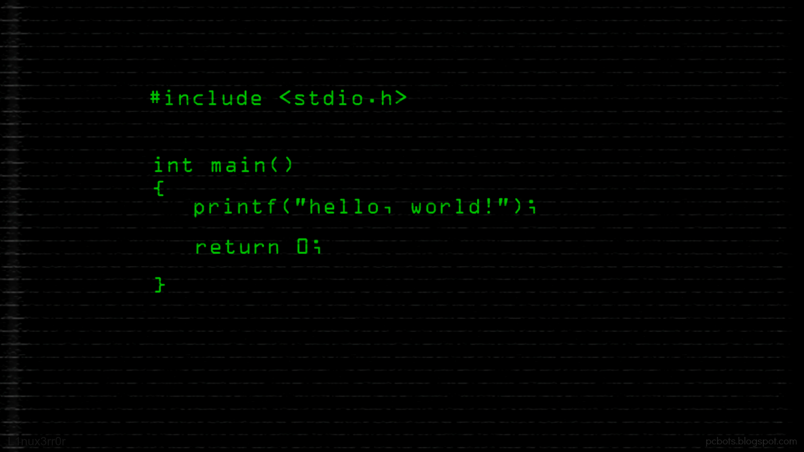

# Algorithm Archive

This project is a personal project to build and catalog as many algorithms and data structures as possible in as many languages as I know.
This list will never be complete, whether it be a new language or another algorithm, but this is meant to be a help for those who need some reference.

## Objectives

- Write as much from scratch as possible
    - However if it makes the code much easier to read and we can assume we have already have built it then that's fine
- Optimize the code when possible but do not over-optimize it such that it is impossible to fluently read
- Even though there are many forms of each algorithm, only write the one best suited to that task
    - Recursive algorithms should have both recursive and non-recursive forms presented
    - Most algorithms just need to be runnable when scalable
- Each algorithm will have a function on the algorithm
    - Driver code is not necessary, but perhaps best to include it in some/many algorithms
    - Code that requires a lot of setup (I.E. Trees or Graphs) should be fully compatable with the other code within the same section
        - E.G. All C++ Tree code should be compatable, All Rust Graph code should be compatable, etc.
    - It just needs to show how it would work and then let any user be able to implement it themselves
    - That being said, if there is a clear pattern being developed, try and follow it 
- For Data Structures all algorithms that are "class" based should be implemented there
    - No need for another folder for the "insert / remove" functions

## Contribution

- Code
    - Name it the same as the file unless
        - It is another algorithm 
        - It is an additional piece of the algorithm
    - If there is both a good recursive and non-recursive algorithm then identify which is which in the name
    - If you need a driver for the function itself, that is ok
        - E.G. quicksort(array) --> quicksort(array, 0, len(array))
    - If another function or algorithm is needed to make an algorithm work (E.G. Determinant and Major) then write the algorithm with both functions but make a note that another section for the "helper" function should also be made
    - Error Code IS required but does not need to be extensive or cover every case
        - Ex : If an input to fact(n) is not an integer or is below 0, write error code but specify HOW you are showing the error
        - Ex : If an input vertex does not exist in a Graph, then YES throw an error
    - I would say either throw an error, return a -1 or equivalent, or in languages like Go have an error value returned as well
- Formatting
    - Brackets should be K&R either original or 1TBS variant
    - Indentation is a tab or 4 spaces conversion
    - Spaces should be between all the operators possible but not the keywords and parenthesis
        - Ex [Spaces] `a == b`, `k = c + m.Min()`, `a[2] = c % 7`
        - Ex [No Spaces] `while(true)`, (Python example) `c = a**b`
        - If there is a piece of code where not having the spaces looks fine then it is ok
    - Anything beyond these should be noted and a consensus will be determined

## READMEs
- Must have be organized with Name, Setup, Input, Output, Pseudocode, and Runtime
- Name is Level 1
- Setup is Level 2, Input and Output are under Setup
- Pseudocode is Level 2, If there is a recursive pseudocde, there must also be non-recursive pseudocode unless specified for true simplicity
- Pseudocode must contain `signature: function(a, b, c, ...)`
- Runtime is Level 2
- Worst, Avg, Best runtimes of algorithm (O, Theta, Omega) should also be listed when applicable

## Organization

- Algorithm Type 
    - Algorithm 
        - Programming Language
OR
- Data Structure
    - Programming Language
        - Algorithm / Structure Functionality

## Table of Contents

- Algorithms
    - Basic Programs 
        - Hello World 
    - Basic Numerical Algorithms 
        - Factorial
        - GCD (Euclid's GCD)
    - Sorting 
        - Note :: Sorts are inplace unless otherwise specified
        - Bubble Sort
        - Insertion Sort
- Data Structures
    - Trees 
        - Binary Search Tree
    - Stack, Heap, Queue 
        - Stack
        - Heap
        - Queue
- TBD
    - Matrices 
        - Determinant
        - Major
